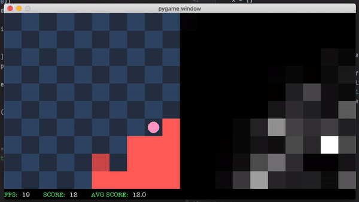

Left: a [Deep Q-Network](https://arxiv.org/abs/1312.5602)-based agent trained on a Macbook for several hours plays Snake.
Right: cell-wise attributions of the policy network obtained by taking the gradient of the network's output with respect to the inputs.
